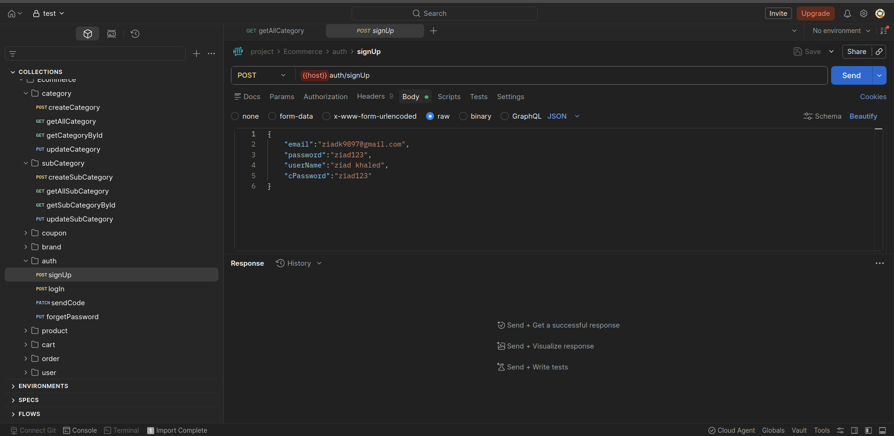
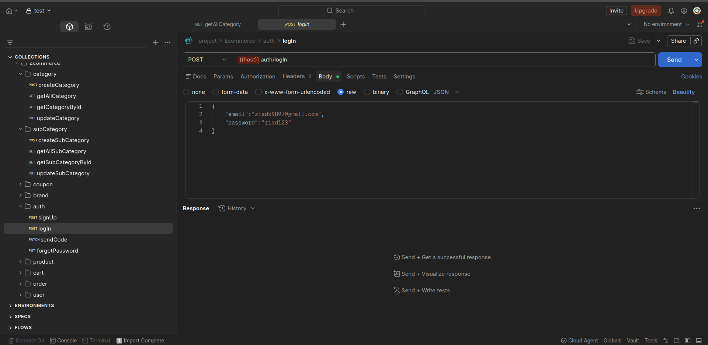
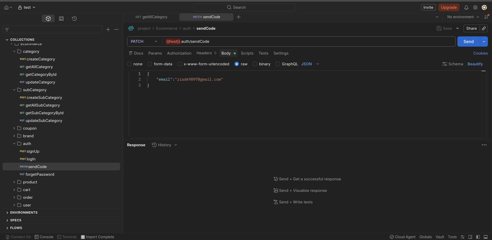
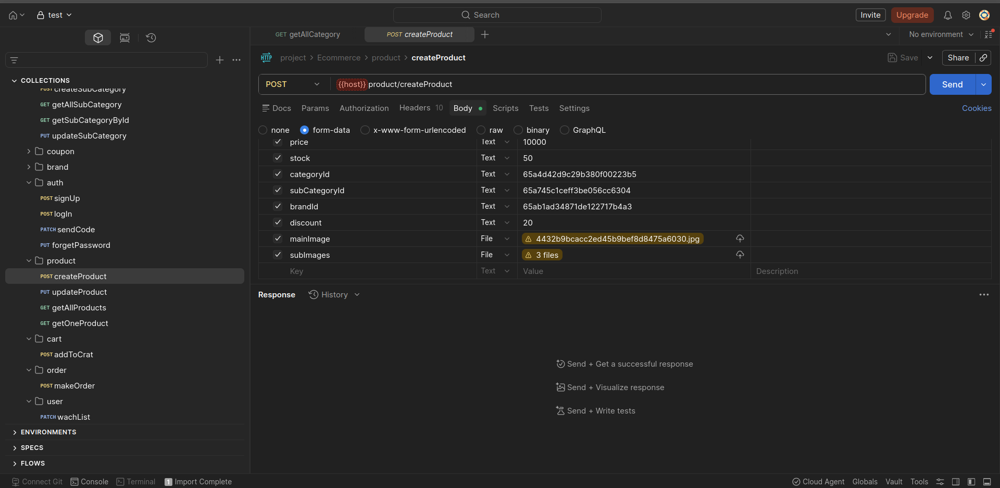
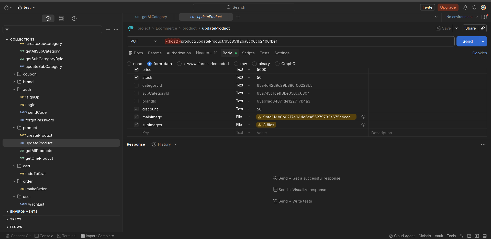
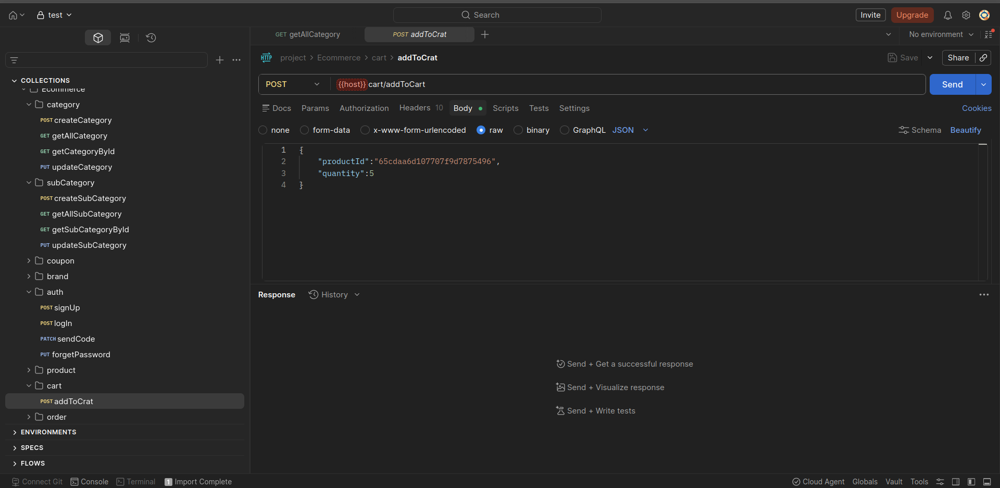
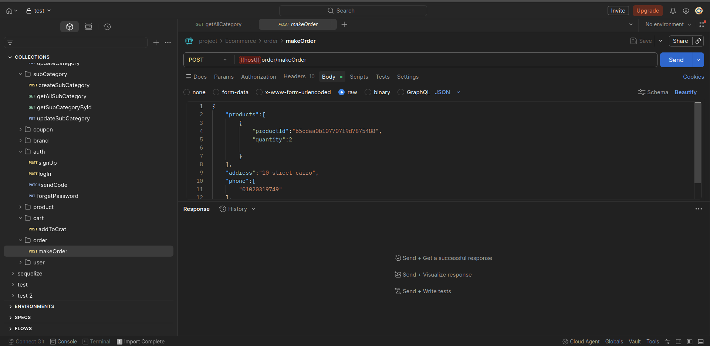
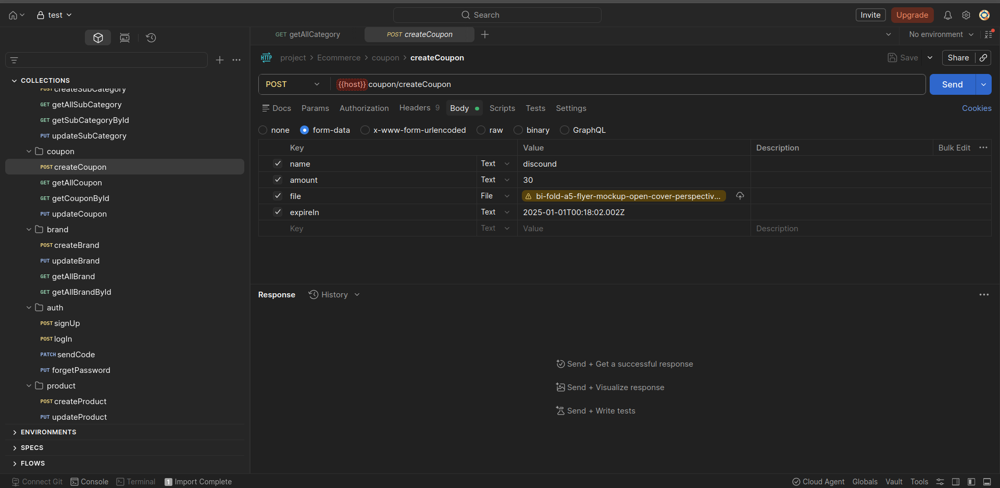
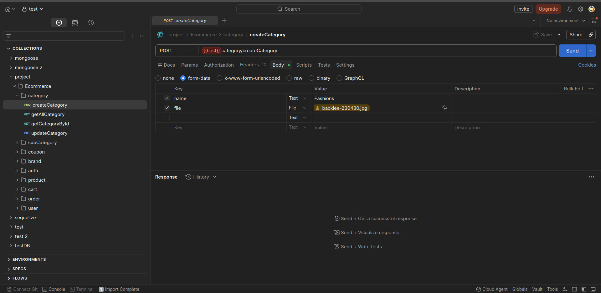
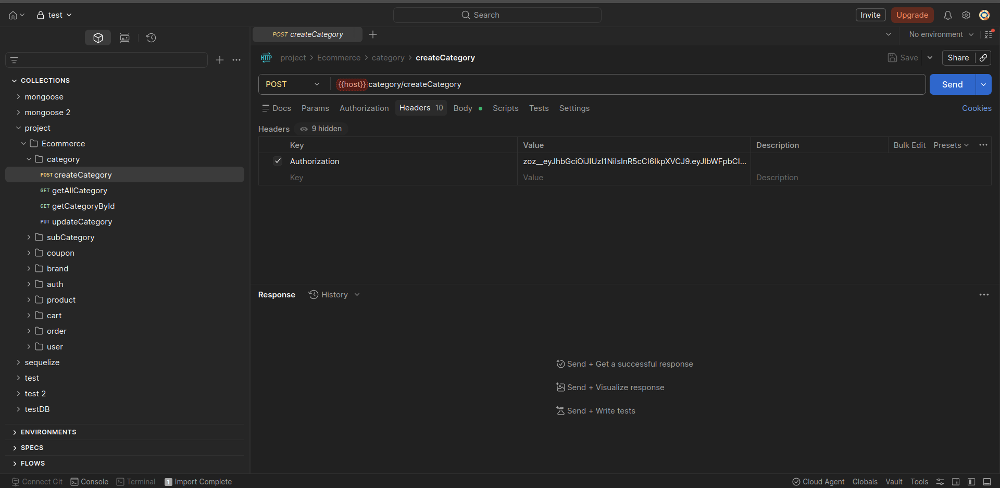

# Ecommerce Backend API

A scalable E-commerce REST API built using Node.js, Express.js, and MongoDB.

---

## Features

- Authentication & Authorization  
- User Management  
- Product Management  
- Category Management  
- Cart System  
- Order System  
- Coupon System  
- Reviews System  
- File Uploads with Cloudinary  
- JWT Authentication  
- Error Handling Middleware  
- Validation using Joi  

---

## Technologies

- Node.js  
- Express.js  
- MongoDB  
- Mongoose  
- JWT  
- Joi  
- Cloudinary  
- Multer  

---

## Installation

```bash
git clone <repo-url>

npm install

npm run dev

## Environment Variables

Create a `.env` file and add the variables from `.env.example`

---

## Postman Collection

The project includes a Postman collection to test all APIs.
You can import the Postman collection file into Postman to test all APIs.

File:
project.postman_collection.json

## API Screenshots

### Authentication API




---

### Products API



---

### Cart API


---

### Order API


---

### Coupon API


---

### Category API


